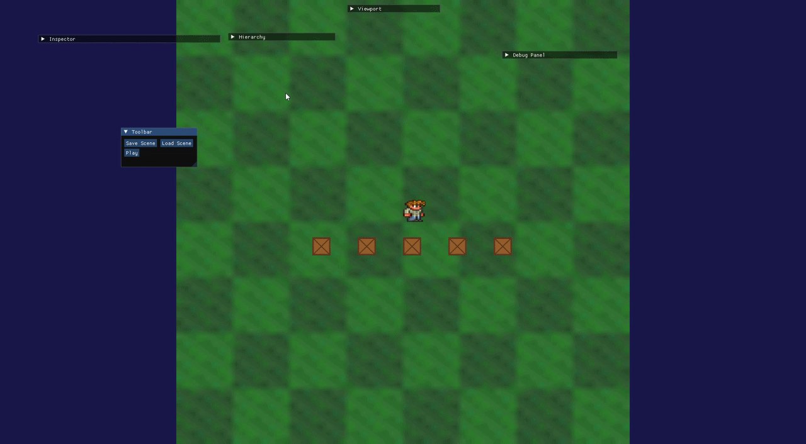
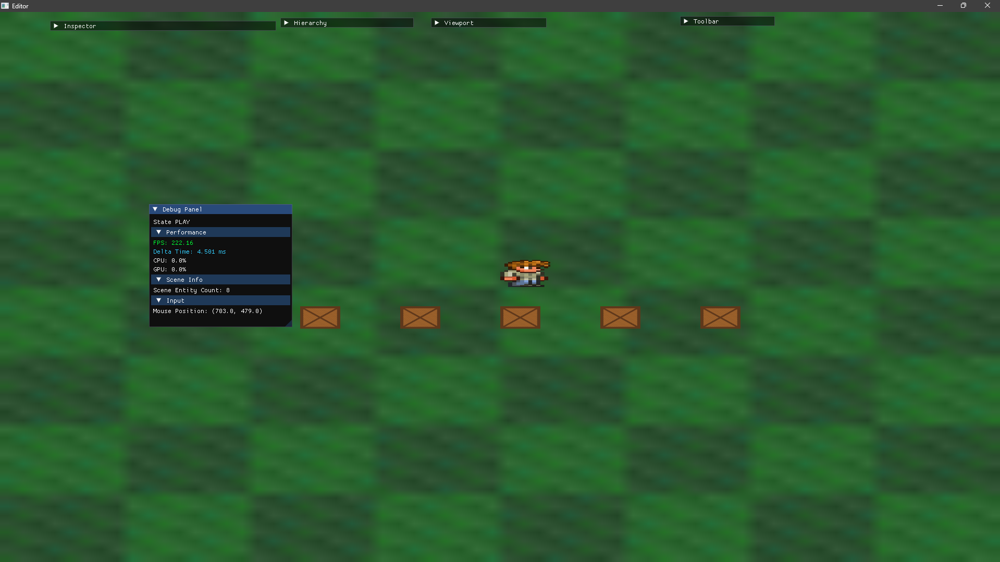
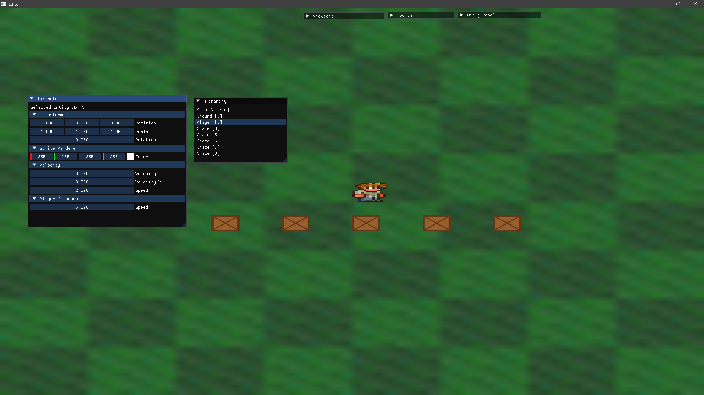

# Raster Engine

Custom-built 2D Game Engine and Editor written in modern C++ using OpenGL.

Features a custom Renderer2D, ECS architecture, scene serialization, editor tooling, and real-time scene editing.



## Features

- Custom Renderer2D
- Dynamic Batch Rendering
- ECS Architecture
- Scene Serialization (YAML)
- Orthographic Camera System
- Real-Time Editor UI
- Scene Hierarchy Panel
- Inspector Panel
- Entity Transform Editing
- Texture Rendering
- Input/Event System
- Layer Stack Architecture
- ImGui Integration


## Technical Highlights

### Renderer2D
- Quad batching system
- Texture slot management
- Indexed rendering pipeline
- OpenGL abstraction layer

### ECS
- Lightweight entity/component architecture
- Data-oriented scene management

### Editor
- Real-time entity editing
- Scene hierarchy
- Inspector panel
- Runtime/editor separation

### Serialization
- YAML-based scene saving/loading
- Persistent entity/component data


## Screenshots

### Editor View


### Scene Hierarchy and Inspector Panel



## Build

### Requirements
- Visual Studio 2022
- Premake5
- OpenGL

### Setup

```bash
git clone https://github.com/PriyanshThapliyal/Raster-Engine
cd Raster-Engine
premake5 vs2022
```

Open the generated solution and build the `Editor` project.

## Repository Structure

```txt
Engine/        -> Core engine source and Dependencies used
Editor/        -> Editor application
Assets/        -> Textures/fonts/scenes
Screenshots/   -> README showcase images
```

## Architecture

Raster Engine is structured into modular systems:

- Renderer
- ECS
- Scene Management
- Serialization
- Input/Event System
- Editor Tools

The Editor operates separately from the runtime layer, allowing real-time scene editing and inspection.

## Future Plans

- Runtime scripting
- Animation system
- Audio engine
- Physics integration
- Tilemap editor
- Undo/Redo system

## LICENCE
This project is licensed under the MIT License
